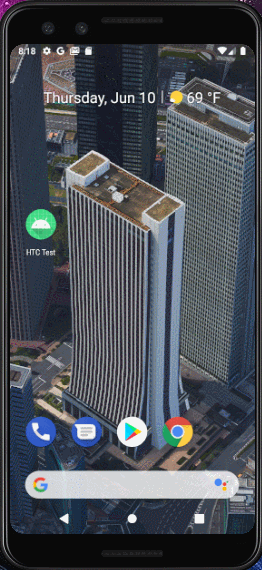
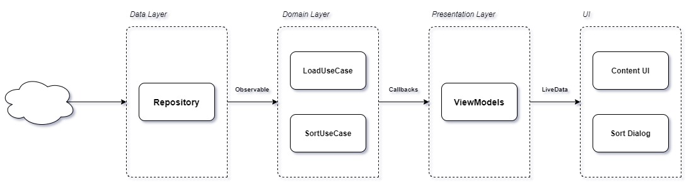

# High Technologies Center Test

 
 
 Загрузить приложение можно [здесь](https://drive.google.com/file/d/1lc03D-Vz4Ic3Oh1EPn7sWYl3QWzFQWkE/view?usp=sharing) или [здесь](employees_test.apk)

## Общее описание задания

 Написать приложение для Android – Список сотрудников компании.

## Требования к приложению

 1. Минимальная поддерживаемая версия Android API - 19;
 2. Приложение должно быть написано на языке Java;
 3. Приложение должно состоять из одного экрана со списком (этот экран
 показывается сразу при открытии приложения);
 4. Для отображения списка использовать элемент RecyclerView;
 5. Список данных в формате JSON приложение загружает из интернета по [ссылке](http://www.mocky.io/v2/5ddcd3673400005800eae483),
 необходимо распарсить эти данные и отобразить их в списке. 
 Для парсинга можно пользоваться готовыми библиотеками, например GSON;
 6. Список должен быть отсортирован по алфавиту. 
                                       
                                       
## Используемый Стэк технологий
 
 Hilt
 RxJava2
 Retrofit
 Google Architecture Component

## Архитектура
 
 The project uses Clean Architecture with MVVM as presentation architecture.
 
 
